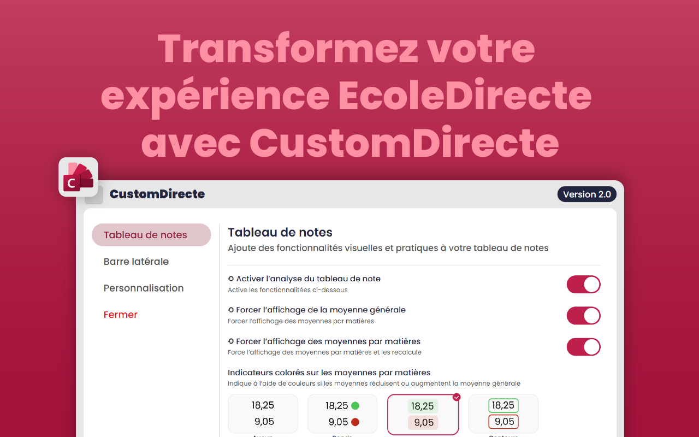

  Un projet de @Bastian-Noel !

---

> **⚠️ Fin du support Firefox — 15 mai 2026**
> Le support et les mises à jour pour l’add-on Firefox sont arrêtés. L’extension n’est plus maintenue pour Firefox. Pour continuer, utilisez la version Chromium.

  Ajoute de nouvelles options sur EcoleDirecte ! Affichez votre moyenne générale, personnalisez l’interface et utilisez de nouveaux outils pour mieux suivre vos résultats.
    
  
  
  
    
  

---

---

## ✨ Voici la liste des 6 fonctionnalités principales

### ★ Un calculateur de moyennes instantané

Un calculateur qui évalue en direct les moyennes par matière ainsi que la moyenne générale à partir des notes affichées sur EcoleDirecte. Les résultats sont actualisés rapidement pour suivre l’évolution de vos notes.

### ★ Une barre latérale repensée

Une nouvelle barre latérale, ou menu, regroupe les options et les outils importants dans un espace plus pratique :

- format plus compact ;
- meilleure lisibilité ;
- davantage de paramètres regroupés au même endroit ;
- accès rapide aux outils, dont le calculateur du bac.

### ★ Un mode sombre

Un mode sombre permet de consulter EcoleDirecte plus confortablement lorsque la luminosité est faible, tout en conservant une interface lisible et agréable.

### ★ Des options de personnalisation

Personnalisez l’affichage selon vos préférences :

- choix de la couleur principale ;
- choix de la police d’écriture ;
- réglage de l’angle des bordures arrondies ;
- choix entre un mode clair et un mode sombre ;
- sélection du style d’interface.

### ★ Un simulateur de notes

Ajoutez des notes fictives ou modifiez temporairement une note pour tester différents scénarios et observer leur impact sur vos moyennes. Les essais restent séparés de vos résultats réels et ne modifient pas les données d’EcoleDirecte.

### ★ Un calculateur du bac

Estimez votre résultat au baccalauréat grâce à un calculateur dédié accessible depuis la barre latérale. Vous pouvez renseigner vos matières et déplacer directement une moyenne du tableau vers le champ correspondant par glisser-déposer.

> [!NOTE]
> Les moyennes sont calculées en utilisant les notes actuellement affichées à l’écran, sans aucun accès restreint pour les élèves ou les parents. Les dernières notes peuvent ainsi être prises en compte sans attendre un nouveau traitement du site.

> [!CAUTION]
>
> - Cette extension ne collecte aucune donnée personnelle.
> - Toutes les modifications apportées au site sont purement visuelles ; en aucun cas, le fonctionnement du site n’est altéré.
> - Cette extension n’est pas affiliée avec le site [EcoleDirecte](https://www.ecoledirecte.com).

## Développement

La structure du projet, le fonctionnement des modules, les règles de contribution et les commandes de développement sont détaillés dans la [documentation technique](docs/ARCHITECTURE.md).
